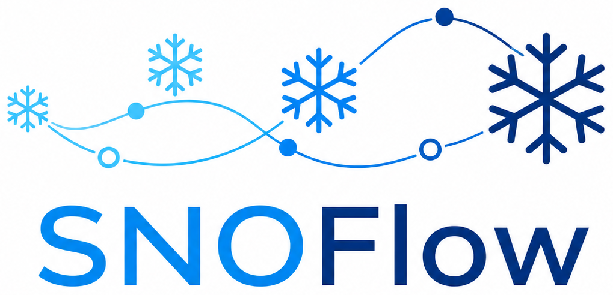
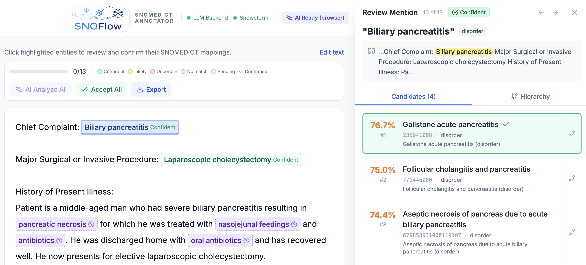

<p align="center">
  
</p>

# SNOFlow

Annotate clinical text with SNOMED CT concepts. An LLM extracts medical entities, [Snowstorm](https://browser.ihtsdotools.org/) finds matching concepts, and a human reviews the results.



## Quick start

### Frontend only (browser-side LLM calls)

```bash
npm install
cp .env.example .env.local   # add your OpenAI key
npm run dev                   # http://localhost:5173
```

A setup wizard runs on first launch. Pick **LLM + Snowstorm** mode and enter an API key.

### With the Python backend

```bash
uv sync
cp .env.example .env          # configure SNOFLOW_* vars
make start-backend            # http://localhost:8001
npm run dev                   # http://localhost:5173, set to Custom Backend mode
```

The backend supports OpenAI, Azure OpenAI, and Anthropic. See `.env.example` for all options.

## Entity Linking Backend Modes

The frontend has two backend modes, selected at setup:

| Mode | Entity extraction | Concept grounding | What you need |
|---|---|---|---|
| **LLM + Snowstorm** (default) | LLM endpoints served via simple Python backend | Snowstorm API for concept retrieval | API key |
| **Custom Backend** | Your own entity linking service | Your own service | Backend running |

For a custom backend example, see [snomed-ct-entity-linking-project](https://github.com/PROVIA1/snomed-ct-entity-linking-project).

The resolver interface is in `src/resolvers/types.ts`.

## Project structure

```
src/                                  # React frontend (Vite + Tailwind)
  App.tsx                             # main state, resolver instantiation
  config.ts                           # localStorage settings persistence
  types.ts                            # shared types, scoring functions
  components/
    EntityText.tsx                    # highlighted clinical text with entities
    MentionPanel.tsx                  # candidate review panel, keyboard nav, hierarchy
    SuggestionsPanel.tsx              # entities needing attention
    ChatPanel.tsx                     # LLM chat about the note
    LLMExplanation.tsx                # per-entity AI analysis with verdicts
    SetupWizard.tsx                   # first-run configuration
    ProviderSettings.tsx              # API key configuration
    EmbeddedGraph.tsx                 # SVG hierarchy graph
    ConceptHierarchyView.tsx          # list-based hierarchy view
    SettingsBar.tsx                   # top-k, threshold, example selector
    ProgressBar.tsx                   # review progress
  resolvers/
    snowstormResolver.ts              # LLM extraction -> Snowstorm lookup
    customBackendResolver.ts          # proxies to the Python backend
  services/
    snowstorm.ts                      # Snowstorm REST client (throttled, retry)
    examples.ts                       # example clinical texts
    llm/
      types.ts                        # all prompts and prompt builders
      openai.ts                       # OpenAI transport
      azure.ts                        # Azure OpenAI transport
  contexts/
    LLMContext.tsx                     # provider state, analysis cache
  utils/
    export.ts                         # JSON annotation export

backend/                              # FastAPI backend (Python, uv)
  main.py                             # app factory, lifespan, middleware
  config.py                           # SNOFLOW_* env var config
  models.py                           # Pydantic request/response models
  prompts/                            # prompt templates + loader
  llm/
    base.py                           # LLMClient ABC
    openai_client.py                  # OpenAI
    azure_client.py                   # Azure OpenAI
    anthropic_client.py               # Anthropic
    factory.py                        # client selection from config
  snowstorm/
    client.py                         # Snowstorm REST client
    agentic_search.py                 # iterative LLM-guided concept search
  routes/
    extract.py                        # POST /api/v1/extract (NER + linking)
    entities.py                       # POST /api/v1/entities (NER only)
    linking.py                        # POST /api/v1/linking (rerank candidates)
    discussion.py                     # POST /api/v1/discussion (chat)
    hierarchy.py                      # GET  /api/v1/concepts/{id}/hierarchy
    health.py                         # GET  /health
  tests/                              # pytest unit tests (mocked)
```

## Backend API

| Endpoint | Method | Purpose |
|---|---|---|
| `/api/v1/extract` | POST | NER + Snowstorm linking (`{ text, top_k, threshold }`) |
| `/api/v1/entities` | POST | NER only |
| `/api/v1/linking` | POST | Rerank candidates for extracted entities |
| `/api/v1/discussion` | POST | Clinical chat |
| `/api/v1/concepts/{id}/hierarchy` | GET | SNOMED hierarchy via Snowstorm |
| `/health` | GET | Health check |

Swagger docs at `http://localhost:8001/docs` when the backend is running.

## Frontend prompts

All browser-side LLM prompts live in `src/services/llm/types.ts`. The provider files (`openai.ts`, `azure.ts`) are transport only.

## Environment variables

All optional. The frontend setup wizard can configure LLM credentials at runtime.

**Frontend** (`VITE_*`, used in browser-side LLM mode):

| Variable | Default | Purpose |
|---|---|---|
| `VITE_OPENAI_API_KEY` | -- | OpenAI API key |
| `VITE_OPENAI_MODEL` | `gpt-4o-mini` | OpenAI model |
| `VITE_AZURE_OPENAI_ENDPOINT` | -- | Azure endpoint |
| `VITE_AZURE_OPENAI_API_KEY` | -- | Azure API key |
| `VITE_AZURE_OPENAI_DEPLOYMENT_NAME` | -- | Azure deployment |
| `VITE_SNOWSTORM_URL` | IHTSDO public server | Snowstorm server |

**Backend** (`SNOFLOW_*`, see `.env.example` for the full list):

| Variable | Default | Purpose |
|---|---|---|
| `SNOFLOW_LLM_BACKEND` | `openai` | `openai`, `azure-openai`, or `anthropic` |
| `SNOFLOW_OPENAI_API_KEY` | -- | OpenAI API key |
| `SNOFLOW_ANTHROPIC_API_KEY` | -- | Anthropic API key |
| `SNOFLOW_SNOWSTORM_URL` | IHTSDO public server | Snowstorm server |
| `SNOFLOW_SNOWSTORM_CACHE_FILE` | -- | Cache Snowstorm responses to file |
| `SNOFLOW_SNOWSTORM_CACHE_ONLY` | `false` | Offline mode (serve from cache only) |
| `SNOFLOW_AGENTIC_SEARCH_ENABLED` | `false` | LLM iteratively searches for better concepts |

## Keyboard shortcuts

| Key | Action |
|---|---|
| `↑`/`↓` or `j`/`k` | Navigate candidates |
| `Enter` | Select candidate |
| `1`-`5` | Quick-select by rank |
| `h` | View hierarchy |
| `n` | Mark as not a medical concept |
| `←`/`→` | Previous/next entity |
| `Tab`/`Shift+Tab` | Next/previous entity |
| `Esc` | Close panel |

## Stack

- **Frontend:** React 18, TypeScript, Vite, Tailwind CSS
- **Backend:** FastAPI, Pydantic, httpx, OpenAI/Anthropic SDKs (Python 3.10+, managed with uv)
- **External:** Snowstorm terminology server (IHTSDO public instance or self-hosted)
